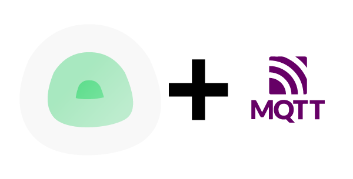

   

# DEPRECATED - Uptime Kuma, with a hint of MQTT

NOTE: As of July 31, 2025, this container will no longer receive any updates. The codebase will be archived and the hosted docker images will be deleted after December 31, 2025. This is for two reasons:
1. Uptime Kuma V2 is right around the corner. V2-beta3 is stable and containes the approrpriate Paho-MQTT and Apprise libraries to work using the unaltered image from Louis.
2. The Uptime Kuma V1.23.16 Debian image, the last stable version of V1, is based on Debian Buster which ended support after June 30, 2025.  No further updates to that base image will be made available, and it already has several high CVE vulnerabilities that need resolution by using the newer version of Debian, like Bookworm.

# RECOMMENDATION

Even though Uptime Kuma V2 has not yet been released, the beta 3 version is quite stable. I recommend [following these instructions to upgrade your V1 instance to V2-beta3](https://github.com/louislam/uptime-kuma/wiki/Migration-From-v1-To-v2).
